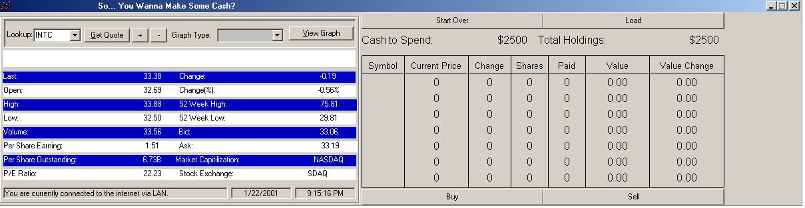



## Stock Market Game

### Description

This is a program that i wrote to show my parents that i could make money on the market. It really came to be quite a nice program. It gives you $2500 to spend in stocks, its all real-time and it even costs $8 to trade like E*trade etc. Please let me know if you find any bugs and i will help you fix them and/or fix them myself.
 
### More Info
 
Just the stock you want to purchase.

Just be careful of what you touch, cause i trained myself from books so the coding is a lil confusing. Its 1/24 11:57 and i am uploading this again... this time with real-time trading. Didnt realize that the other was delayed... sorry for any inconvienience. Quotes are from yahoo. I got most of the bugs now... and thats about it. Have Fun!

Prices, changes etc.

Sometimes just gives STRANGE errors, like really big numbers etc.

             |
---                |---
**Submitted On**   |2001-01-24 23:59:04
**By**             |[bailout](https://github.com/Planet-Source-Code/PSCIndex/blob/master/ByAuthor/bailout.md)
**Level**          |Advanced
**User Rating**    |3.8 (23 globes from 6 users)
**Compatibility**  |VB 5\.0, VB 6\.0
**Category**       |[Complete Applications](https://github.com/Planet-Source-Code/PSCIndex/blob/master/ByCategory/complete-applications__1-27.md)
**World**          |[Visual Basic](https://github.com/Planet-Source-Code/PSCIndex/blob/master/ByWorld/visual-basic.md)
**Archive File**   |[CODE\_UPLOAD141441252001\.zip](https://github.com/Planet-Source-Code/bailout-stock-market-game__1-14638/archive/master.zip)

